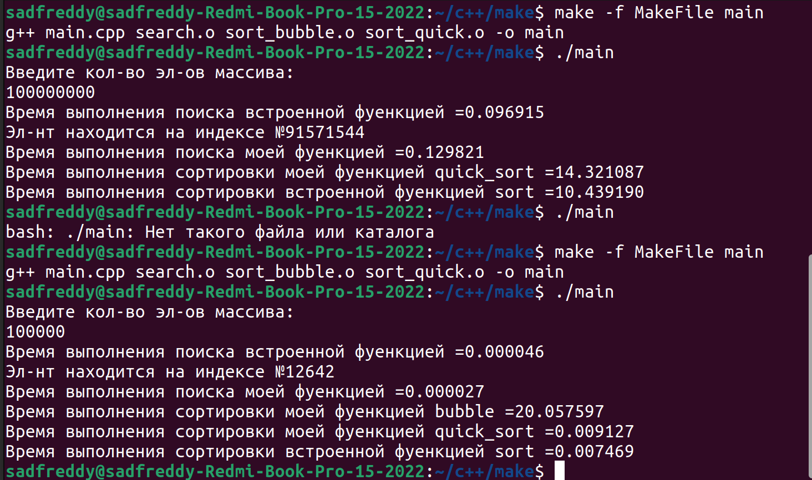

# sortsandsearch
## Описание сборки и использования библиотеки sortsandsearch.
1. Для сборки библиотеки понадобится библиотеки sort_bubble, sort_quick и search, исполняемый файл MakeFile и main.cpp для тестирования.

2. Содать папку, где будет храниться программа

3. В директории папки сохранить sort_bubble.cpp,sort_bubble.h,  sort_quick.cpp, sort_quick.h, search.cpp, search.h, MakeFile и main.cpp
   
4. [Cсылка на репозитрой, где можно найти все файлы:](https://github.com/stumpfeklinge/sortsandsearch)

5. Открыть консоль в дирекории папки и прописать след. команду make -f MakeFile main

6. Может понадобиться установить утилиту make;

7. Запустить main командой ./main;

## Результаты работы: 

